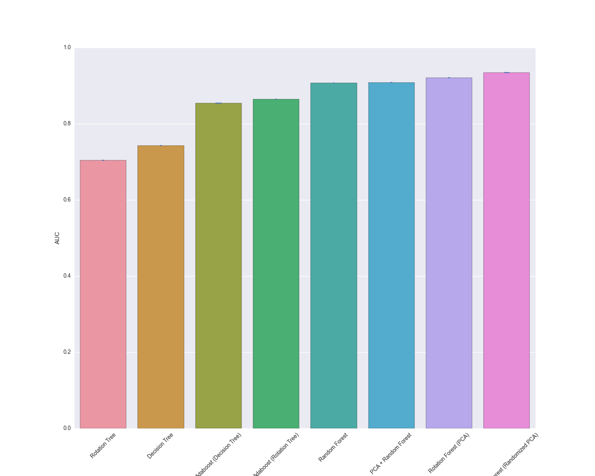

Rotation Forest
===============
Simple hack to sklearn's random forest module to implement the Rotation Forest algorithm from Rodriguez et al. 2006.

Algorithm
---------
for tree in trees:
- split the attributes in the training set into K non-overlapping subsets of equal size.
- bootstrap 75% of the data from each K dataset and use the bootstrap data in the following steps.
- Run PCA on the ith subset in K. Retain all principal components. For every feature j in the Kth subsets, we have a principal component a.

Create a rotation matrix of size n X n where n is the total number of features. Arrange
the principal component in the matrix such that the components match the position of the feature in the original training dataset.

Project the training dataset on the rotation matrix.

Build a decision tree with the projected dataset

Store the tree and the rotation matrix.

